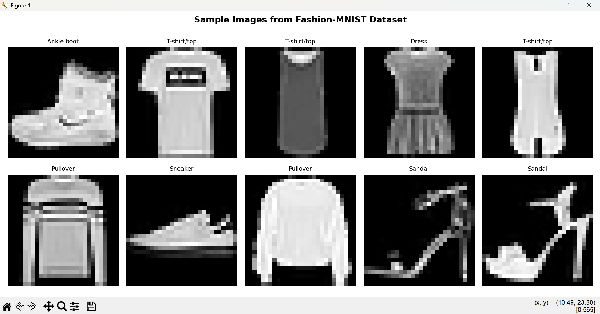
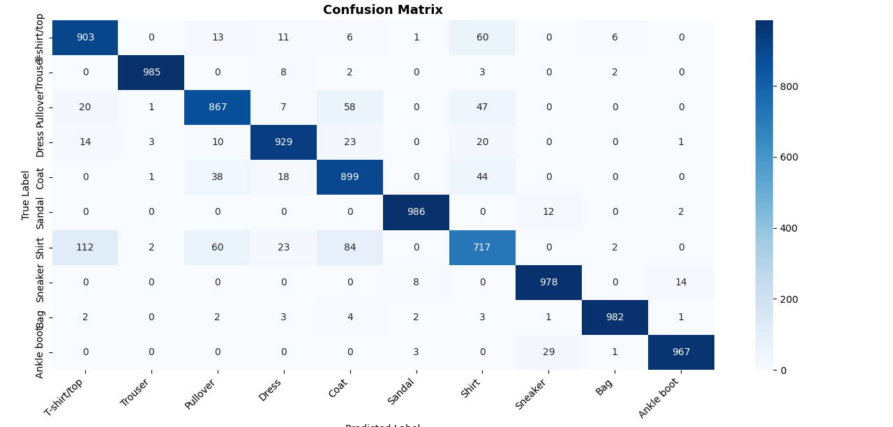

# 👗 Fashion Item Classifier using CNN

A deep learning project that classifies fashion items into 10 categories
using Convolutional Neural Networks built with TensorFlow/Keras.


## 📌 Project Overview
Fashion-MNIST contains 70,000 grayscale images of fashion products 
across 10 categories. This project builds a CNN model to automatically 
classify these items achieving **92.13% test accuracy**.

## 🎯 Categories
| Label | Category |
|-------|----------|
| 0 | T-shirt/top |
| 1 | Trouser |
| 2 | Pullover |
| 3 | Dress |
| 4 | Coat |
| 5 | Sandal |
| 6 | Shirt |
| 7 | Sneaker |
| 8 | Bag |
| 9 | Ankle boot |

## 📈 Results
| Metric | Score |
|--------|-------|
| Test Accuracy | **92.13%** |
| Test Loss | < 0.25 |
| Epochs | 15 |
| Batch Size | 64 |
| Optimizer | Adam |

## 🧠 Model Architecture
Input (28x28x1)

↓

Conv2D (32 filters) → MaxPooling

↓

Conv2D (64 filters) → MaxPooling

↓

Conv2D (128 filters)

↓

Flatten

↓

Dense (256) → Dropout (0.5)

↓

Output Dense (10) → Softmax
## 🛠️ Tech Stack
- Python 3.10
- TensorFlow 2.21
- Keras
- NumPy
- Matplotlib
- Scikit-learn
- Seaborn

## 🚀 How to Run

**1. Clone the repository**
```bash
git clone https://github.com/yourusername/fashion-item-classifier
cd fashion-item-classifier
```

**2. Install dependencies**
```bash
pip install tensorflow numpy matplotlib scikit-learn seaborn
```

**3. Run the project**
```bash
python fashion_mnist_cnn.py
```

## 📁 Project Structure
fashion-item-classifier/

│

├── fashion_mnist_cnn.py   # Main project file

├── README.md              # Project documentation

└── results/               # Screenshots of results

├── sample_images.png

├── model_summary.png

├── training_epochs.png

├── confusion_matrix.png

└── loss_accuracy_curves.png
## 📊 Sample Results

### Sample Images


### Training Loss & Accuracy


### Confusion Matrix


## 👨‍💻 Author
**Fayaz Ali**  
Computer Systems Engineering Student  
Quaid-e-Awam University of Engineering, Sciences & Technology  
📧 ifayazunar@gmail.com
